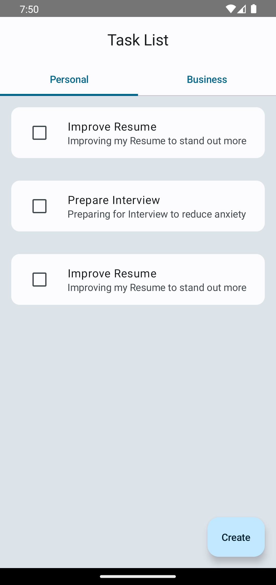

# Taskify Android App [Work in Progress 🚧]

Taskify is an Android application designed to help users manage personal and business tasks efficiently. Built with **Kotlin** and **Jetpack Compose**, Taskify offers a modern, sleek interface and uses **SQLDelight** for local database management, providing a smooth experience without cloud dependency.

The app is currently in early development and not available on the Google Play Store yet.

## Features

- **Jetpack Compose**: Utilizes the modern UI toolkit for building responsive, native Android UIs.
- **Kotlin**: A modern programming language enhancing Android development speed and quality.
- **SQLDelight**: A type-safe Kotlin Multiplatform library to interact with a local SQLite database.
- **Task Creation & Editing**: Easily create, edit, and manage your tasks.
- **Task Deletion**: Remove unnecessary tasks with ease.
- **Task Prioritization**: Assign priority levels (Low, Medium, High) for better task management.
- **Dark Mode**: Seamless support for system-wide dark mode for improved visibility and comfort.
- **Glance Widgets**: Access and view tasks directly from the home screen with widgets.
- **Catalogs**: Organize tasks into personalized catalogs (e.g., Personal, Business) for better structure.

## Screenshots



## Installation

To run a local instance of Taskify, follow the steps below.

### Prerequisites

- **Android Studio**
- **Kotlin 2.0+**
- **Android SDK 35**

### Steps

1. **Clone the repository**:

   ```bash
   git clone https://github.com/iNoles/TaskList.git
   ```

2. **Open the project**:

- Open Android Studio.
- Click on ``File -> Open``.
- Navigate to the directory where you cloned the project and select it.
- Click on ``Open``.

3. **Build and Run**:

- Ensure you have an Android device connected or an emulator running.
- Click on the ``Run`` button in Android Studio.

## Contributing

Contributions are what make the open-source community such an amazing place to be, learn, inspire, and create. Any contributions you make are greatly appreciated.

- Fork the project.
- Create your feature branch (git checkout -b feature/AmazingFeature).
- Commit your changes (git commit -m 'Add some AmazingFeature').
- Push to the branch (git push origin feature/AmazingFeature).
- Open a Pull Request.
